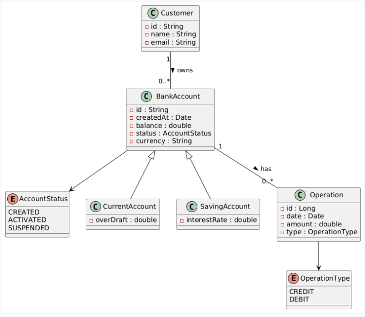

# 🏦 Digital Banking Backend Application

## 📋 Table des Matières
- [Vue d'ensemble](#vue-densemble)
- [Architecture du Projet](#architecture-du-projet)
- [Technologies Utilisées](#technologies-utilisées)
- [Structure du Projet](#structure-du-projet)
- [Modèle de Données](#modèle-de-données)
- [API Endpoints](#api-endpoints)
- [Sécurité](#sécurité)
- [Installation et Configuration](#installation-et-configuration)
- [Tests et Documentation](#tests-et-documentation)

## 🎯 Vue d'ensemble

**Digital Banking** est une application backend complète développée avec Spring Boot qui simule un système bancaire numérique. L'application permet la gestion des clients, des comptes bancaires (courants et épargne), et des opérations bancaires avec un système d'authentification JWT sécurisé.

### Fonctionnalités Principales
- Gestion complète des clients (CRUD)
- Gestion des comptes bancaires (Courant et Épargne)
- Opérations bancaires (Débit, Crédit, Virement)
- Historique des opérations avec pagination
- Authentification JWT sécurisée
- API REST documentée avec Swagger
- Recherche et filtrage des données
- Gestion des exceptions personnalisées

## 🏗️ Architecture du Projet

L'application suit une **architecture en couches** (Layered Architecture) avec les principes de **Domain Driven Design (DDD)** :

```
┌─────────────────────────────────────┐
│           Presentation Layer        │
│        (REST Controllers)           │
├─────────────────────────────────────┤
│           Service Layer             │
│        (Business Logic)             │
├─────────────────────────────────────┤
│           Repository Layer          │
│        (Data Access)                │
├─────────────────────────────────────┤
│           Database Layer            │
│        (MySQL/H2)                   │
└─────────────────────────────────────┘
```

### Patterns Utilisés
- **Repository Pattern** : Abstraction de l'accès aux données
- **DTO Pattern** : Transfert de données entre couches
- **Mapper Pattern** : Conversion entre entités et DTOs
- **Exception Handling** : Gestion centralisée des erreurs
- **Dependency Injection** : Inversion de contrôle avec Spring

## 🛠️ Technologies Utilisées

### Backend Framework
- **Spring Boot 3.4.5** - Framework principal
- **Spring Data JPA** - Persistance des données
- **Spring Security** - Sécurité et authentification
- **Spring Web** - API REST

### Base de Données
- **MySQL** - Base de données principale
- **H2** - Base de données en mémoire (tests)

### Sécurité
- **JWT (JSON Web Tokens)** - Authentification stateless
- **OAuth2 Resource Server** - Gestion des tokens
- **BCrypt** - Hachage des mots de passe


## 📁 Structure du Projet

```
src/main/java/ma/enset/Digital_Banking/
├── 📁 entities/                    # Entités JPA
│   ├── Customer.java              # Entité Client
│   ├── BankAccount.java           # Entité Compte (abstraite)
│   ├── CurrentAccount.java        # Compte Courant
│   ├── SavingAccount.java         # Compte Épargne
│   └── AccountOperation.java      # Opération Bancaire
├── 📁 dtos/                       # Data Transfer Objects
│   ├── CustomerDTO.java
│   ├── BankAccountDTO.java
│   ├── CurrentBankAccountDTO.java
│   ├── SavingBankAccountDTO.java
│   ├── AccountOperationDTO.java
│   ├── AccountHistoryDTO.java
│   ├── CreditDTO.java
│   ├── DebitDTO.java
│   └── TransferRequestDTO.java
├── 📁 repositories/               # Couche d'accès aux données
│   ├── CustomerRepository.java
│   ├── BankAccountRepository.java
│   └── AccountOperationRepository.java
├── 📁 service/                    # Logique métier
│   ├── BankAccountService.java
│   └── BankAccountServiceImpl.java
├── 📁 web/                        # Contrôleurs REST
│   ├── CustomerRestController.java
│   └── BankAccountRestAPI.java
├── 📁 security/                   # Configuration sécurité
│   ├── SecurityConfig.java
│   └── SecurityController.java
├── 📁 mappers/                    # Conversion entités/DTOs
│   └── BankAccountMapperImpl.java
├── 📁 enums/                      # Énumérations
│   ├── AccountStatus.java
│   └── OperationType.java
├── 📁 Exceptions/                 # Exceptions personnalisées
│   ├── CustomerNotFoundException.java
│   ├── BankAccountNotFoundException.java
│   └── BalanceNotSufficientException.java
└── DigitalBankingApplication.java # Classe principale
```

## 🗄️ Modèle de Données

### Diagramme de Classes UML




#### **Architecture du Modèle**
Le diagramme illustre une architecture orientée objet avec :

**🏗️ Entités Principales :**
- **Customer** : Client de la banque (id, name, email)
- **BankAccount** : Classe abstraite pour les comptes (id, createdAt, balance, status, currency)
- **CurrentAccount** : Compte courant avec découvert autorisé
- **SavingAccount** : Compte épargne avec taux d'intérêt
- **Operation** : Opérations bancaires (id, date, amount, type)

**🔗 Relations :**
- **Customer → BankAccount** : One-to-Many (1 client peut avoir plusieurs comptes)
- **BankAccount → Operation** : One-to-Many (1 compte peut avoir plusieurs opérations)
- **Héritage** : CurrentAccount et SavingAccount héritent de BankAccount

**📋 Énumérations :**
- **AccountStatus** : CREATED, ACTIVATED, SUSPENDED
- **OperationType** : CREDIT, DEBIT

### Relations
- **Customer** ↔ **BankAccount** : One-to-Many (Un client peut avoir plusieurs comptes)
- **BankAccount** ↔ **AccountOperation** : One-to-Many (Un compte peut avoir plusieurs opérations)
- **Héritage** : CurrentAccount et SavingAccount héritent de BankAccount (Table Per Hierarchy)

### Énumérations
- **AccountStatus** : `CREATED`, `ACTIVATED`, `SUSPENDED`
- **OperationType** : `DEBIT`, `CREDIT`

## 🔌 API Endpoints

### 🔐 Authentification
| Méthode | Endpoint | Description | Accès |
|---------|----------|-------------|-------|
| `POST` | `/auth/login` | Connexion utilisateur | Public |
| `GET` | `/auth/profile` | Profil utilisateur connecté | Authentifié |

### 👥 Gestion des Clients
| Méthode | Endpoint | Description | Accès |
|---------|----------|-------------|-------|
| `GET` | `/customers` | Liste tous les clients | Authentifié |
| `GET` | `/customers/{id}` | Détails d'un client | Authentifié |
| `GET` | `/customers/search?keyword=` | Recherche clients | Authentifié |
| `GET` | `/customers/paginated?page=&size=` | Clients paginés | Authentifié |
| `POST` | `/customers` | Créer un client | Authentifié |
| `PUT` | `/customers/{id}` | Modifier un client | Authentifié |
| `DELETE` | `/customers/{id}` | Supprimer un client | Authentifié |

### 🏦 Gestion des Comptes
| Méthode | Endpoint | Description | Accès |
|---------|----------|-------------|-------|
| `GET` | `/accounts` | Liste tous les comptes | Authentifié |
| `GET` | `/accounts/{id}` | Détails d'un compte | Authentifié |
| `GET` | `/accounts/{id}/operations` | Historique des opérations | Authentifié |
| `GET` | `/accounts/{id}/pageOperations` | Historique paginé | Authentifié |
| `POST` | `/accounts/debit` | Opération de débit | Authentifié |
| `POST` | `/accounts/credit` | Opération de crédit | Authentifié |
| `POST` | `/accounts/transfer` | Virement entre comptes | Authentifié |

### 📊 Exemples de Requêtes

#### Connexion
```bash
POST /auth/login
Content-Type: application/x-www-form-urlencoded

username=user1&password=1234
```

#### Créer un client
```bash
POST /customers
Authorization: Bearer {jwt_token}
Content-Type: application/json

{
  "name": "John Doe",
  "email": "john.doe@email.com"
}
```

#### Effectuer un débit
```bash
POST /accounts/debit
Authorization: Bearer {jwt_token}
Content-Type: application/json

{
  "accountId": "account-uuid",
  "amount": 100.0,
  "description": "Retrait ATM"
}
```

## 🔒 Sécurité

### Authentification JWT
L'application utilise **JSON Web Tokens (JWT)** pour l'authentification stateless :

- **Algorithme** : HMAC SHA-512
- **Durée de vie** : 1 heure
- **Claims** : username, authorities, iat, exp

### Utilisateurs par Défaut
| Username | Password | Rôles |
|----------|----------|-------|
| `user1` | `1234` | USER |
| `admin` | `1234` | ADMIN |

### Configuration de Sécurité
- **Session Management** : STATELESS
- **CSRF** : Désactivé (API REST)
- **CORS** : Configuré pour le frontend
- **Password Encoding** : BCrypt

### Endpoints Publics
- `/auth/login/**` - Authentification
- `/swagger-ui/**` - Documentation API
- `/v3/api-docs/**` - Spécification OpenAPI

## ⚙️ Installation et Configuration

### Prérequis
- **Java 17+**
- **Maven 3.6+**
- **MySQL 8.0+** (optionnel, H2 par défaut)

### Configuration Base de Données

#### MySQL (Production)
```properties
spring.datasource.url=jdbc:mysql://localhost:3306/e-bank?createDatabaseIfNotExist=true
spring.datasource.username=root
spring.datasource.password=your_password
spring.jpa.properties.hibernate.dialect=org.hibernate.dialect.MariaDBDialect
```

#### H2 (Développement)
```properties
spring.datasource.url=jdbc:h2:mem:bank
spring.datasource.driverClassName=org.h2.Driver
spring.h2.console.enabled=true
```

### Démarrage de l'Application

1. **Cloner le projet**
```bash
git clone <repository-url>
cd Digital-Banking
```

2. **Compiler et démarrer**
```bash
# Avec Maven wrapper
./mvnw spring-boot:run

# Ou avec Maven installé
mvn spring-boot:run
```

3. **Accéder à l'application**
- **API** : http://localhost:8080
- **Swagger UI** : http://localhost:8080/swagger-ui.html
- **H2 Console** : http://localhost:8080/h2-console

### Variables d'Environnement
```properties
# JWT Secret Key
jwt.secret=b317e1b986d0fc1b643421dbf66f221286576a5cbe68ce0d477694078f239c1f

# Server Configuration
server.port=8080
spring.application.name=DigitalBanking

# JPA Configuration
spring.jpa.hibernate.ddl-auto=update
spring.jpa.show-sql=true
```

## 📚 Tests et Documentation

### Documentation API
- **Swagger UI** : Interface interactive pour tester l'API
- **OpenAPI 3** : Spécification complète de l'API
- **Postman Collection** : Collection disponible pour les tests

### Données de Test
L'application génère automatiquement des données de test au démarrage :
- **3 clients** : Ikrame, Fatima, Karima
- **6 comptes** : 2 par client (1 courant + 1 épargne)
- **60 opérations** : 10 par compte (débits et crédits aléatoires)

### Tests Unitaires
```bash
# Exécuter tous les tests
./mvnw test

# Tests avec couverture
./mvnw test jacoco:report
```

## 🚀 Fonctionnalités Avancées

### Pagination
- Support de la pagination pour les listes importantes
- Paramètres : `page` (défaut: 0), `size` (défaut: 10)

### Recherche
- Recherche de clients par nom avec wildcards
- Filtrage des opérations par compte

### Gestion d'Erreurs
- Exceptions personnalisées avec messages explicites
- Codes de statut HTTP appropriés
- Logs détaillés pour le debugging

### Validation
- Validation des données d'entrée
- Contraintes métier (solde suffisant, etc.)
- Messages d'erreur localisés

## 👨‍💻 Auteur

**Projet développé dans le cadre d'un cours sur Spring Boot et les architectures microservices.**

---

*Ce README présente une vue d'ensemble complète du projet Digital Banking Backend. Pour plus de détails techniques, consultez la documentation Swagger intégrée.*
